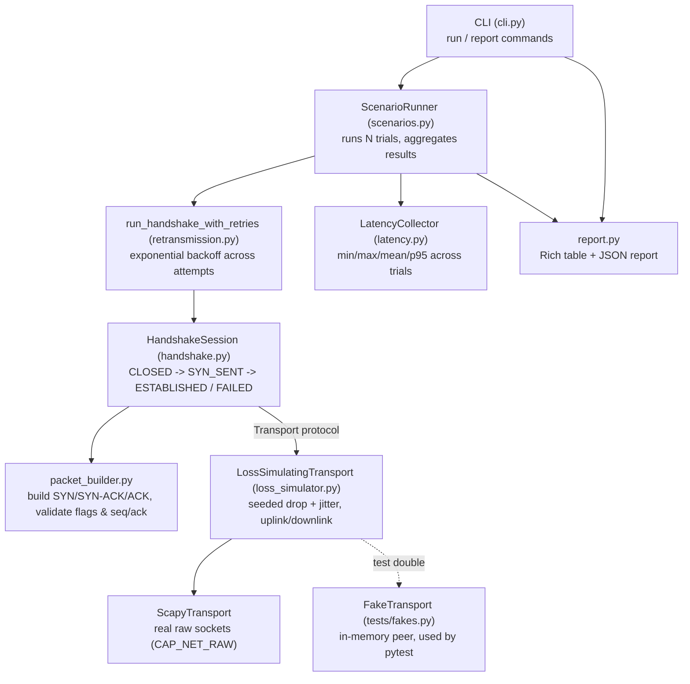

# NetProbe

NetProbe is a Python/Scapy framework for exercising TCP/IP fundamentals end to end:
constructing and validating three-way handshakes, detecting retransmissions,
measuring latency, and doing all of it under configurable, injected packet loss
(up to 30%+). Results are captured with pytest assertions and packaged into a
reproducible CLI tool that runs in Docker on Linux, so the same regression
scenarios produce comparable results run to run.

## What it does

- Builds real SYN / SYN-ACK / ACK segments with Scapy and validates responses
  against the sequence-number and flag arithmetic the TCP RFC specifies.
- Drives a handshake through an explicit state machine
  (`CLOSED -> SYN_SENT -> ESTABLISHED / FAILED`), independent of the transport,
  so the same logic runs over a real raw socket or an in-memory fake in tests.
- Injects packet loss and jitter through a seeded, reproducible simulation
  layer (`LossSimulatingTransport`), with independent uplink/downlink rates.
- Detects retransmissions structurally (same segment sent twice) and drives
  a retry loop with exponential backoff when attempts fail.
- Aggregates repeated trials into per-scenario success rate, retransmission
  counts and latency statistics (mean/median/p95).
- Ships a `netprobe` CLI that runs a set of headline scenarios against a
  target and renders a table or JSON report.

## Architecture



`HandshakeSession` only depends on a small `Transport` protocol (`send` /
`sr1`). In production that's `ScapyTransport` (real raw sockets), wrapped by
`LossSimulatingTransport` to inject loss; in tests it's `FakeTransport`, an
in-memory stand-in for a TCP peer. This is what lets the whole
scenario/retry/latency pipeline be exercised by pytest without root
privileges or a network.

## Project layout

```
netprobe/
  config.py           network / loss / retransmission / scenario dataclasses
  exceptions.py        typed exceptions (HandshakeTimeout, SequenceMismatch, ...)
  packet_builder.py    Scapy packet construction + validation
  handshake.py          three-way handshake state machine + Transport protocol
  loss_simulator.py     seeded packet-loss / jitter injection
  retransmission.py    duplicate-send detection + retry/backoff loop
  latency.py             RTT statistics (percentile, LatencyCollector)
  scenarios.py           ScenarioRunner + headline scenario definitions
  report.py               Rich table + JSON rendering
  cli.py                   `netprobe run` / `netprobe report`
tests/
  fakes.py                in-memory Transport test doubles
  test_*.py               pytest suite (packet builder, handshake, retransmission,
                           latency, loss simulator, scenarios, CLI)
```

## Running it

Sending raw SYN/ACK segments requires **root, or `CAP_NET_RAW`** (Scapy opens
a raw socket) -- this is a hard requirement of the raw-socket approach, not
a NetProbe-specific choice.

### Locally

```bash
python -m venv .venv && source .venv/bin/activate
pip install -e ".[dev]"

# needs elevated privileges to send raw packets:
sudo $(which netprobe) run --target 192.0.2.10 --port 443
```

Useful flags: `--scenario NAME` (repeatable, defaults to all headline
scenarios), `--loss 0.3`, `--trials 50`, `--seed 7` (reproducible loss
pattern), `--format json --output results.json`.

### Docker

```bash
docker build -t netprobe .
docker run --rm --cap-add=NET_RAW --cap-add=NET_ADMIN \
    netprobe run --target 192.0.2.10 --port 443 --format json
```

`--cap-add=NET_RAW --cap-add=NET_ADMIN` grants just enough for Scapy's raw
sockets without running the container `--privileged`.

### Headline scenarios

| Scenario | Loss | Purpose |
|---|---|---|
| `clean-handshake` | 0% | Baseline: no simulated loss |
| `handshake-10pct-loss` | 10% | Moderate loss stress |
| `handshake-30pct-loss` | 30% | NetProbe's namesake stress scenario |
| `retransmission-stress` | 30%, tight retry budget | Surfaces retry exhaustion quickly |

## Testing

The pytest suite runs entirely against `FakeTransport`, an in-memory stand-in
for a TCP peer -- no raw sockets, no root, no real network needed:

```bash
pip install -e ".[dev]"
pytest
```

This covers packet construction/validation, the handshake state machine,
retransmission backoff and structural duplicate detection, latency
statistics, the loss simulator's statistical behavior (drop rate converges
to the configured rate over many trials; a fixed seed reproduces the same
drop sequence), scenario aggregation, and CLI argument handling.

A `root_required` pytest marker is reserved for tests that need a real raw
socket against an actual peer; none are included by default
(`pyproject.toml`'s `addopts` excludes them), since that requires a live
target and elevated privileges the CI/sandbox environment doesn't have. Run
them explicitly with `pytest -m root_required` on a host/container with
`CAP_NET_RAW` and a reachable target.
